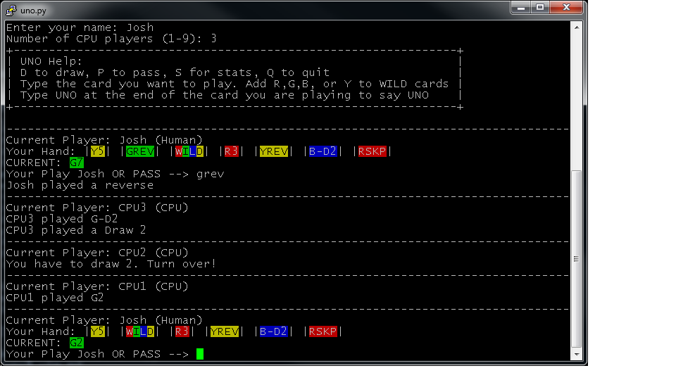

Terminal UNO
============

Play UNO with up to 9 other CPU players
---------------------------------------

I enjoy playing the popular UNO card game, so as a programming exercise, I decided to program the game using Python. 

uno.py has been tested in Linux bash terminals, and Windows Command Prompts. Your results may vary.

### Author
* Josh Burks
* dotnofoolin@gmail.com

### Requirements
* Python 2.7 (developed using 2.7.4)
* colorama 0.2.7

### Usage
* python uno.py
* Enter your player name, and enter the number of CPU players you want to play against.
* Type the card you want to play. Add the color (R,G,B,Y) to the end of WILD or W-D4 cards (ex: WILDG).
* If you can't play, try typing D to draw a card. Type P to pass if you still can't play.
* Don't forget to say UNO when you play your next to last card! Add UNO to the card you are playing (ex: R5UNO)
* Type S to get stats about the other players hands
* Type Q to quit. The CPU players will continue to play without you until someone wins.

### Disclaimer
* Code may not be 100% Pythonic. Untested with Python 3 (yet)
* I programmed the game logic around the rules I'm accustomed to playing with.
* No affiliation with offical UNO. I did this just for fun.

### TODO
* More testing, because there is never enough
* Implement a web version
